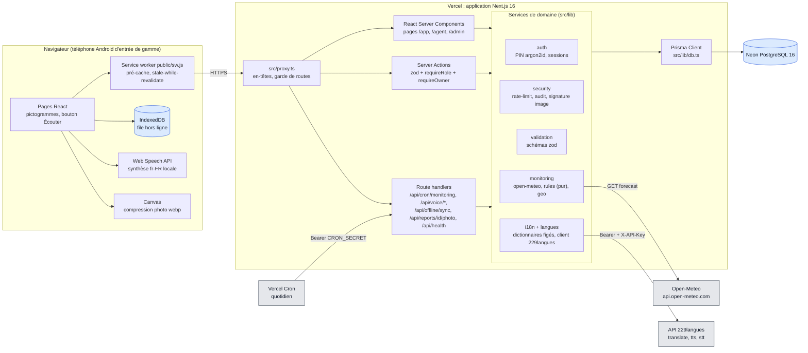
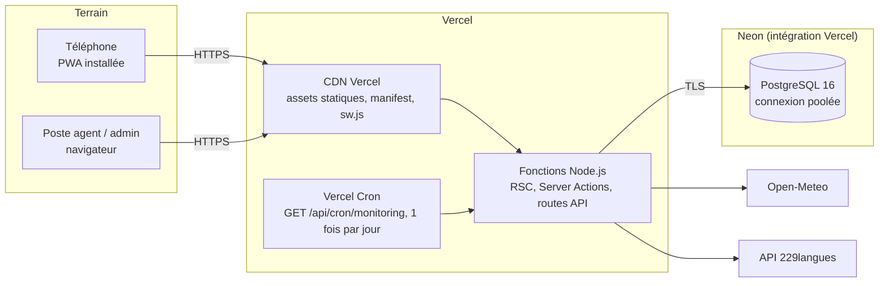

# AgriVeille : architecture

> Ce document **décrit** l'architecture approuvée dans [`docs/SPEC.md`](SPEC.md). Il ne la remet pas en cause.
> Modèle de données : [`prisma/schema.prisma`](../prisma/schema.prisma) (source de vérité).
> Diagrammes UML : [`docs/uml/`](uml/README.md).

## 1. Vue d'ensemble

AgriVeille est un **monolithe Next.js 16** (App Router, React 19, TypeScript strict) déployé sur Vercel, avec une base
**PostgreSQL** (Neon en production) accédée par **Prisma 6**. Côté client, l'application est une **PWA** : un service
worker, un pré-cache et une file IndexedDB lui permettent de fonctionner quand le réseau est intermittent. Trois services
externes, tous optionnels pour la disponibilité du cœur :

| Dépendance | Rôle | Si elle tombe |
|---|---|---|
| Open-Meteo | prévisions 7 jours par parcelle | on réutilise le dernier `WeatherSnapshot`, même expiré ; sinon la parcelle est ignorée et l'erreur journalisée. Délai borné à 8 s (`OPEN_METEO_TIMEOUT_MS`). |
| API 229langues | traduction fr vers fon/yo, TTS, STT | textes fon/yo à `null`, affichage en **français** ; audio : texte affiché plus synthèse fr du navigateur ; dictée : « indisponible », la photo et les pictogrammes suffisent. |
| Vercel Cron | déclenchement quotidien du monitoring | déclencheurs de secours : ouverture d'une parcelle dont le snapshot a expiré, bouton AGENT « Lancer l'analyse ». |
| Neon PostgreSQL | persistance | panne franche : les pages en cache du service worker restent lisibles, et les signalements comme les accusés attendent dans la file IndexedDB. |

Règle d'autorisation, en une phrase : **chaque mutation et chaque lecture d'objet passe par `requireRole` puis, pour les
objets personnels, par `requireOwner`, côté serveur, et l'interface ne fait que refléter ce contrôle.**

## 2. Composants

Responsabilités (une seule par comportement) :

| Composant | Possède | Ne fait pas |
|---|---|---|
| `src/lib/monitoring/rules.ts` | seuils agronomiques, production des alertes candidates avec `dedupKey` | aucun accès réseau ni base : fonction pure, testée par `vitest` |
| `src/lib/monitoring/open-meteo.ts` | appel, délai, validation zod de la réponse | ne décide pas du cache (c'est l'orchestrateur du monitoring) |
| `src/lib/monitoring/geo.ts` | haversine, parcelles dans un rayon | — |
| `src/lib/langues/` | seul client de l'API 229langues (secrets, délais, reprises) | jamais importé côté client |
| `src/lib/i18n/` | dictionnaires `fr/fon/yo.json` figés, choix de la langue, repli fr | ne traduit pas à la volée l'interface |
| `src/lib/auth/` | PIN, sessions, `requireRole`, `requireOwner`, blocage 5 échecs / 15 min | — |
| `src/lib/security/` | rate-limit en base (`RateLimit`), `AuditLog`, vérification de signature d'image | — |
| Server Actions | toutes les mutations des écrans | pas de logique métier propre : elles valident, autorisent, délèguent |
| Route handlers | cron, proxys voix, synchronisation hors ligne, photo autorisée, santé | — |

Propriété des tables : `User`, `Session` → auth ; `RateLimit`, `AuditLog` → security ; `WeatherSnapshot`, `Alert`,
`AlertDelivery`, `SmsOutbox` → monitoring et alertes ; `PestReport` → signalements ; `Listing`, `Offer`,
`ReferencePrice` → marché ; `LevyRate`, `Declaration` → recettes ; `Commune`, `Crop`, `Pest`, `Regulation` → CMS (ADMIN) ;
`TranslationCache`, `AudioCache` → langues.

## 3. Déploiement

Environnements : **dev** avec PostgreSQL dans le conteneur Docker `agriveille-db` (port 5440) ; **prod** avec Vercel et Neon.
Les migrations Prisma et le seed sont exécutés au déploiement. Le planning du cron est déclaré dans la configuration
Vercel (`vercel.json`, fichier qui n'existe pas encore dans le dépôt au moment de la rédaction).

Variables d'environnement (noms seulement, aucune valeur dans le dépôt, `.env` ignoré) :

| Variable | Usage | Exposée au client |
|---|---|---|
| `DATABASE_URL` | connexion PostgreSQL (Neon en prod) | non |
| `CRON_SECRET` | authentifie l'appel du cron (`Authorization: Bearer`) | non |
| `LANGUES_API_BASE` | URL de base de l'API 229langues | non |
| `LANGUES_API_KEY` | en-tête `X-API-Key` | non |
| `LANGUES_HF_TOKEN` | en-tête `Authorization: Bearer` | non |
| `LANGUES_PROJECT_ID` | identifiant de projet 229langues (présent dans `.env`, absent de la SPEC) | non |
| `SESSION_SECRET` | présent dans `.env`, absent de la SPEC (les sessions reposent sur un jeton aléatoire haché) | non |
| `NODE_ENV` | active `Secure` sur le cookie, durcit les en-têtes | non |

Aucune variable `NEXT_PUBLIC_*` n'est nécessaire : aucun secret ni aucune configuration d'API n'est envoyé au navigateur.

Coût récurrent : **0 FCFA** dans la démonstration (offres gratuites Vercel Hobby et Neon Free, Open-Meteo sans clé, SMS
simulé, pas de passerelle de paiement). Les postes payants apparaissent avec les évolutions de la section 8 : SMS réel
(facturé au message), USSD (agrégateur), FedaPay (commission par transaction), Vercel Pro si le cron doit tourner plus
d'une fois par jour ou plus longtemps.

## 4. Flux de données

1. **Monitoring climatique** ([séquence 03](uml/03-sequence-alerte-climatique.md)) : `Parcel(lat, lon)`, puis
   `WeatherSnapshot` (cache 3 h) ou Open-Meteo, puis `rules.evaluate` (pur), puis `Alert` (dedupKey unique, traduite, repli
   fr), puis `AlertDelivery` `IN_APP` + `SMS_SIM` et `SmsOutbox`. L'exploitant·e lit (`READ`) et accuse réception
   (`ACKNOWLEDGED`). Le tableau de bord AGENT affiche le taux d'accusés.
2. **Phytosanitaire** ([séquence 04](uml/04-sequence-signalement-ravageur.md)) : `PestReport` `PENDING` (photo en base,
   dictée), validation AGENT, `Alert PEST_OUTBREAK` de zone (15 km par défaut), sélection des parcelles par haversine,
   livraisons, `AuditLog`.
3. **Récolte** : la règle `HARVEST_WINDOW` (récolte attendue dans 10 jours au plus et 3 jours secs consécutifs) passe par
   le même circuit. Elle débouche sur le marché : l'annonce (`Listing`) reçoit des `Offer`, et le `ReferencePrice` donne le
   repère de prix.
4. **Recettes** : `Declaration` avec `amountDueFcfa` calculé serveur à partir du `LevyRate` (par kg, points de base,
   forfait), `receiptNumber` et `verificationCode`, quittance QR vers `/verifier/<code>` (public, sans donnée personnelle
   superflue), puis paiement simulé ou encaissement au guichet, et validation AGENT.
5. **Contenu** : l'ADMIN édite cultures, ravageurs, fiches réglementaires, prix et barèmes. Les textes fon/yo sont
   proposés par l'API 229langues et enregistrés dans les champs `xxxFon` / `xxxYo`. Chaque action est tracée dans `AuditLog`.

Cycle de vie des données :

| Donnée | Création | Fin de vie |
|---|---|---|
| `Session` | connexion | expiration à 30 jours, déconnexion, ou suppression de l'utilisateur (cascade) |
| `WeatherSnapshot` | appel Open-Meteo | périmé au bout de 3 h ; purge des anciens snapshots possible par le cron (seul le dernier sert) |
| `Alert` / `AlertDelivery` | cron, validation, agent | l'alerte est inactive après `validUntil` et conservée pour l'historique et les KPI |
| `PestReport.photo` | signalement | conservée avec le signalement ; supprimée avec le compte de son auteur (cascade) |
| `SmsOutbox` | livraison `SMS_SIM` | journal de démonstration, purgeable |
| `TranslationCache`, `AudioCache` | premier appel | permanents : la clé est un hachage du texte, donc un texte modifié donne une nouvelle entrée |
| `AuditLog` | action AGENT/ADMIN | conservé ; l'acteur passe à `null` si son compte est supprimé |
| `RateLimit` | première tentative | fenêtre fixe, remise à zéro à l'expiration de la fenêtre |

## 5. Stratégie hors ligne

- **Coquille PWA** : `manifest.webmanifest` et `sw.js`. Pré-cache de la coquille, des pages clés (`/app`, `/app/alertes`,
  `/app/signaler`, `/hors-ligne`) et des pictogrammes SVG.
- **Lecture** : stale-while-revalidate pour les requêtes GET. La dernière version d'une page s'affiche tout de suite, puis
  se met à jour. Sans réseau et sans cache, la page `/hors-ligne` s'affiche. Un bandeau « Hors ligne » est toujours visible.
- **Écriture** : seules deux actions sont mises en file dans IndexedDB, parce qu'elles comptent sur le terrain :
  **signalement** (photo déjà compressée) et **accusé de réception**. Chaque élément porte un `clientId` (UUID) généré
  sur l'appareil.
- **Rejeu** : au retour du réseau (événement `online` ou ouverture de l'application), `POST /api/offline/sync`. Le
  serveur revalide tout (session, rôle, propriété, zod, rate-limit). `PestReport.clientId` est unique et l'accusé est une
  transition monotone, donc rejouer ne crée jamais de doublon. Sur 401 ou 429, l'élément reste dans la file.
- **Sobriété** : JS de la page d'accueil fermier sous 150 Ko gz, SVG plutôt qu'images, Leaflet chargé seulement sur les
  pages carte, pas de tuiles par défaut pour le FARMER (liste), photos compressées à 1280 px en webp qualité 0,7.

## 6. Stratégie multilingue et audio

| Contenu | fr | fon | yo |
|---|---|---|---|
| Interface (libellés) | `messages/fr.json` | `messages/fon.json` généré par 229langues puis **figé** dans le dépôt | `messages/yo.json`, idem |
| Audio de l'interface | Web Speech API (`speechSynthesis` fr-FR), sans réseau | fichiers pré-générés `public/audio/fon/` | `public/audio/yo/` |
| Contenu dynamique (alertes, fiches CMS) | champ `xxxFr` | champ `xxxFon`, traduit à la création via `TranslationCache`, repli fr | champ `xxxYo`, idem |
| Audio d'un contenu dynamique | Web Speech API | proxy `/api/voice/tts`, puis `AudioCache` (wav) | proxy `/api/voice/tts`, puis `AudioCache` (mp3) |
| Dictée | clavier ou Web Speech (si disponible) | proxy `/api/voice/stt` (rate-limité) | proxy `/api/voice/stt` |

Principes : le secret 229langues ne quitte jamais le serveur ; une traduction ou un audio n'est jamais bloquant ; la
langue de l'utilisateur (`User.locale`) choisit le champ affiché, avec repli sur le français ; un texte fon/yo n'est affiché
que s'il existe, et aucun texte n'est traduit à la volée pendant l'affichage.

## 7. Décisions (mini-ADR)

| N° | Décision | Alternatives écartées | Pourquoi | Compromis accepté | Coût de réversibilité |
|---|---|---|---|---|---|
| ADR-1 | **Monolithe Next.js** (UI, API, cron dans un seul déploiement) | front SPA + API séparée ; microservices | un seul artefact à livrer en 15 h, un seul modèle de sécurité, rendu serveur léger pour les téléphones | les services de domaine partagent un processus ; montée en charge verticale, par fonction | moyen : les services `src/lib` sont déjà découpés et sans dépendance à Next, donc extractibles |
| ADR-2 | **Server Actions** pour les mutations, route handlers seulement là où un client non-React appelle (cron, sync, voix, photo) | API REST ou tRPC pour tout | moins de code, formulaires fonctionnels sans JS, protection CSRF native | chaque action doit refaire zod et les contrôles d'autorisation, rien n'est implicite | faible : une action appelle un service, qu'une route peut appeler aussi |
| ADR-3 | **Photos en base** (`PestReport.photo Bytes`, 300 Ko au plus) | stockage objet (Vercel Blob, S3) | aucune dépendance ni secret de plus, contrôle d'accès identique à la donnée, suppression en cascade | base plus lourde ; convenable pour un volume de démonstration, pas pour des dizaines de milliers de photos | moyen : migration vers un stockage objet avec une colonne `photoKey` et un script de copie |
| ADR-4 | **Traductions figées pour l'interface, cache pour le contenu** | traduction à la volée à chaque affichage | l'API est lente au premier appel (jusqu'à 60 s) ; les chaînes figées sont relisibles et versionnées | les traductions automatiques ne sont pas relues par un locuteur natif (voir section 8) | faible |
| ADR-5 | **SMS simulé** (`SmsOutbox`, canal `SMS_SIM`, page `/agent/sms` étiquetée DÉMO) | agrégateur SMS réel | pas de contrat opérateur ni de coût dans le délai ; la chaîne de livraison reste démontrable de bout en bout | aucun SMS ne part réellement | faible : remplacer l'écriture `SmsOutbox` par un adaptateur d'envoi, l'énumération `DeliveryChannel` est prête |
| ADR-6 | **Paiement non réel** : bouton « Payer (démo) » ou encaissement déclaré au guichet par un AGENT | intégration Mobile Money | aucune transaction financière réelle sans agrément ni recette ; la quittance QR et le calcul serveur restent réels | le statut `PAID` ne prouve pas un encaissement électronique | moyen : ajouter un webhook FedaPay qui fait passer la déclaration à `PAID` |

Décisions héritées de la SPEC (non rediscutées ici) : PostgreSQL + Prisma 6, zod v4, argon2id, sessions en base,
Leaflet, pnpm, Vercel + Neon.

## 8. Limites et évolutions

| Limite actuelle | Évolution proposée |
|---|---|
| SMS simulé | agrégateur SMS béninois (opérateurs MTN et Moov) derrière l'interface de livraison, avec un budget de messages par alerte et par sévérité |
| Pas d'accès sans smartphone | **USSD** (canal `USSD_SIM` déjà modélisé) : menu court pour consulter les alertes et accuser réception depuis un téléphone simple |
| Paiement simulé | **Mobile Money via FedaPay** (MTN MoMo, Moov Money) : initiation depuis la quittance, webhook signé qui marque `PAID`, rapprochement AGENT |
| Traductions automatiques non relues | **relecture humaine** par des locuteurs fon et yoruba (agents DDAEP), statut « relu » par champ, priorité aux alertes CRITICAL |
| Seuils agronomiques simples, prévisions à maille globale | **modèles de prévision plus fins** : bilan hydrique par culture (coefficients culturaux FAO-56), données de stations locales (Météo-Bénin), historique des signalements pour pondérer `PEST_RISK` |
| Photos en base | stockage objet quand le volume dépasse quelques milliers de signalements |
| Cron quotidien en une seule exécution | traitement par lots avec reprise, ou file de tâches, si le nombre de parcelles dépasse le budget d'une fonction |

## 9. Registre des risques

| Risque | Probabilité | Impact | Parade |
|---|---|---|---|
| API 229langues lente ou coupée pendant la démonstration | moyenne | moyen | dictionnaires figés, `TranslationCache`, `AudioCache`, audio d'interface pré-généré, repli fr |
| Open-Meteo indisponible | faible | élevé (monitoring) | réutilisation du snapshot expiré, déclencheurs de secours |
| Durée maximale d'une fonction Vercel atteinte par le cron | moyenne | moyen | budget de temps, bilan partiel, reprise au déclenchement suivant |
| Doublons d'alertes (exécutions concurrentes) | moyenne | faible | `dedupKey` unique, `unique(alertId, userId, channel)` |
| IDOR sur parcelles, livraisons, photos | moyenne | élevé | `requireOwner` à chaque objet, tests e2e d'accès croisé |
| Traduction fon/yo erronée sur une alerte CRITICAL | moyenne | élevé | pictogramme et niveau de sévérité compréhensibles sans texte, relecture humaine (évolution) |
| Base alourdie par les photos | faible (démo) | faible | limite 300 Ko, ADR-3 réversible |

## 10. Hypothèses restantes

- Vercel Cron transmet `CRON_SECRET` dans `Authorization: Bearer` quand la variable est définie (comportement documenté par Vercel).
- Les utilisateurs cibles ont un smartphone Android avec navigateur récent (service worker, IndexedDB, géolocalisation).
- Les seuils agronomiques de la SPEC §4 sont indicatifs : ils conviennent à une démonstration, pas à un conseil officiel.
- Les données de démonstration sont fictives. Aucune référence légale n'est inventée (`Regulation.sourceRef`).
