# 01 — Diagramme de cas d'utilisation

> Source : [SPEC §2 (acteurs et rôles)](../SPEC.md#2-acteurs-et-rôles-rbac-vérifié-côté-serveur-jamais-seulement-dans-lui),
> §4 (monitoring), §5 (langues), §7 (routes).
> Mermaid n'a pas de type « use case » natif : le diagramme est un `flowchart LR` stylé selon les conventions UML.

## Conventions de lecture

| Élément UML | Représentation ici |
|---|---|
| Acteur principal (humain) | rectangle arrondi en gras, à gauche, marqué `«acteur»` |
| Acteur secondaire (système) | rectangle gris, à droite, marqué `«système»` |
| Cas d'utilisation | ovale `([...])` |
| Frontière du système | cadre `AgriVeille`, subdivisé en paquetages |
| Association acteur – cas | trait plein |
| `«include»` (toujours exécuté) | flèche pointillée du cas de base vers le cas inclus |
| `«extend»` (optionnel) | flèche pointillée de l'extension vers le cas de base |
| Généralisation d'acteurs | flèche pleine `hérite de` |

L'acteur **Visiteur·se** (non connecté) est ajouté parce que la SPEC définit des pages publiques. Tout acteur connecté
hérite de ses cas. L'Administrateur·rice hérite de tous les cas de l'Agent de l'État (SPEC §2 : « tout ce qu'AGENT peut + CMS »).

## Diagramme

```mermaid
flowchart LR
    %% ---------- Acteurs principaux (gauche) ----------
    VIS["«acteur»<br/>Visiteur·se<br/>(non connecté)"]
    FAR["«acteur»<br/>Exploitant·e<br/>FARMER"]
    BUY["«acteur»<br/>Acheteur·se<br/>BUYER"]
    AGE["«acteur»<br/>Agent de l'État<br/>AGENT"]
    ADM["«acteur»<br/>Administrateur·rice<br/>ADMIN"]

    FAR -->|hérite de| VIS
    BUY -->|hérite de| VIS
    AGE -->|hérite de| VIS
    ADM -->|hérite de| AGE

    subgraph SYS["AgriVeille"]
        direction TB

        subgraph PK_CPT["Compte"]
            direction TB
            UC_INS(["S'inscrire<br/>téléphone + PIN"])
            UC_CON(["Se connecter<br/>téléphone + PIN"])
            UC_LNG(["Choisir la langue<br/>fr / fon / yo"])
            UC_PRO(["Gérer son profil"])
            UC_DEC(["Se déconnecter"])
        end

        subgraph PK_MON["Monitoring"]
            direction TB
            UC_PAR(["Gérer ses parcelles"])
            UC_PLA(["Gérer ses cultures<br/>sur parcelle"])
            UC_MET(["Consulter la météo 7 j<br/>d'une parcelle"])
            UC_ALE(["Consulter ses alertes"])
            UC_ACK(["Accuser réception<br/>d'une alerte"])
            UC_ECO(["Écouter un contenu<br/>en fr / fon / yo"])
            UC_SIG(["Signaler un ravageur"])
            UC_PHO(["Joindre une photo"])
            UC_VOI(["Dicter en fon / yoruba"])
            UC_GEO(["Géolocaliser<br/>le signalement"])
            UC_SYN(["Synchroniser<br/>la file hors ligne"])
            UC_VAL(["Valider / rejeter<br/>un signalement"])
            UC_ZON(["Émettre une alerte<br/>de zone"])
            UC_ANA(["Lancer l'analyse<br/>climatique"])
            UC_AUT(["Générer les alertes<br/>automatiques"])
            UC_PRV(["Obtenir les prévisions<br/>météo"])
            UC_LIV(["Livrer une alerte<br/>IN_APP + SMS simulé"])
            UC_TRA(["Traduire un contenu<br/>fr vers fon / yo"])
            UC_TDB(["Consulter le tableau de bord<br/>carte, KPI, taux d'accusés"])
            UC_SMS(["Consulter le simulateur<br/>SMS / USSD — DÉMO"])
        end

        subgraph PK_MAR["Marché"]
            direction TB
            UC_PMA(["Parcourir le marché"])
            UC_PRX(["Consulter les prix<br/>de référence"])
            UC_ANN(["Publier une annonce"])
            UC_REP(["Répondre à une offre<br/>accepter / refuser"])
            UC_OFF(["Faire une offre"])
            UC_SUI(["Suivre / retirer<br/>ses offres"])
        end

        subgraph PK_REC["Recettes"]
            direction TB
            UC_DCL(["Déclarer une vente<br/>ou une redevance"])
            UC_CAL(["Calculer le montant dû<br/>côté serveur"])
            UC_QUI(["Obtenir sa quittance QR"])
            UC_PAY(["Payer — simulation"])
            UC_VER(["Vérifier une quittance<br/>par QR"])
            UC_VDE(["Valider une déclaration<br/>/ encaisser au guichet"])
            UC_RCT(["Suivre les recettes"])
        end

        subgraph PK_INF["Information / Réglementation"]
            direction TB
            UC_REG(["Lire la réglementation"])
            UC_FIC(["Consulter une fiche<br/>ravageur / culture"])
        end

        subgraph PK_ADM["Administration"]
            direction TB
            UC_CCU(["Gérer les cultures"])
            UC_CRA(["Gérer les ravageurs"])
            UC_CRG(["Gérer les fiches<br/>réglementaires"])
            UC_CPR(["Gérer les prix<br/>de référence"])
            UC_CTX(["Gérer les taux<br/>de redevance"])
            UC_CUS(["Gérer les utilisateurs"])
            UC_AUD(["Consulter le journal<br/>d'audit"])
        end
    end

    %% ---------- Acteurs secondaires (droite) ----------
    OM["«système»<br/>Open-Meteo"]
    LG["«système»<br/>API 229langues"]
    CR["«système»<br/>Planificateur<br/>Vercel Cron"]

    %% ---------- Associations : Visiteur·se ----------
    VIS --- UC_LNG
    VIS --- UC_INS
    VIS --- UC_CON
    VIS --- UC_REG
    VIS --- UC_PMA
    VIS --- UC_PRX
    VIS --- UC_VER
    VIS --- UC_ECO

    %% ---------- Associations : Exploitant·e ----------
    FAR --- UC_PRO
    FAR --- UC_DEC
    FAR --- UC_PAR
    FAR --- UC_PLA
    FAR --- UC_MET
    FAR --- UC_ALE
    FAR --- UC_ACK
    FAR --- UC_SIG
    FAR --- UC_ANN
    FAR --- UC_REP
    FAR --- UC_DCL
    FAR --- UC_QUI
    FAR --- UC_FIC

    %% ---------- Associations : Acheteur·se ----------
    BUY --- UC_OFF
    BUY --- UC_SUI
    BUY --- UC_PRO

    %% ---------- Associations : Agent de l'État ----------
    AGE --- UC_VAL
    AGE --- UC_ZON
    AGE --- UC_ANA
    AGE --- UC_TDB
    AGE --- UC_VDE
    AGE --- UC_RCT
    AGE --- UC_SMS

    %% ---------- Associations : Administrateur·rice ----------
    ADM --- UC_CCU
    ADM --- UC_CRA
    ADM --- UC_CRG
    ADM --- UC_CPR
    ADM --- UC_CTX
    ADM --- UC_CUS
    ADM --- UC_AUD

    %% ---------- include / extend ----------
    UC_SIG -.->|«include»| UC_GEO
    UC_PHO -.->|«extend»| UC_SIG
    UC_VOI -.->|«extend»| UC_SIG
    UC_SYN -.->|«extend»| UC_SIG
    UC_SYN -.->|«extend»| UC_ACK
    UC_ACK -.->|«include»| UC_ALE
    UC_ECO -.->|«extend»| UC_ALE
    UC_ECO -.->|«extend»| UC_REG
    UC_MET -.->|«include»| UC_PRV
    UC_ANA -.->|«include»| UC_AUT
    UC_AUT -.->|«include»| UC_PRV
    UC_AUT -.->|«include»| UC_TRA
    UC_AUT -.->|«include»| UC_LIV
    UC_VAL -.->|«include»| UC_FIC
    UC_ZON -.->|«include»| UC_TRA
    UC_ZON -.->|«include»| UC_LIV
    UC_DCL -.->|«include»| UC_CAL
    UC_QUI -.->|«include»| UC_DCL
    UC_PAY -.->|«extend»| UC_QUI
    UC_REP -.->|«include»| UC_ANN
    UC_OFF -.->|«include»| UC_PMA
    UC_CRG -.->|«include»| UC_TRA
    UC_CRA -.->|«include»| UC_TRA

    %% ---------- Acteurs secondaires ----------
    CR --- UC_AUT
    UC_PRV --- OM
    UC_TRA --- LG
    UC_VOI --- LG
    UC_ECO --- LG

    %% ---------- Styles ----------
    classDef actor fill:#ffffff,stroke:#1f2937,stroke-width:2px,color:#111827,font-weight:bold
    classDef sysactor fill:#e5e7eb,stroke:#4b5563,stroke-width:2px,color:#111827
    classDef uc fill:#fef9c3,stroke:#a16207,stroke-width:1px,color:#111827
    class VIS,FAR,BUY,AGE,ADM actor
    class OM,LG,CR sysactor
    class UC_INS,UC_CON,UC_LNG,UC_PRO,UC_DEC,UC_PAR,UC_PLA,UC_MET,UC_ALE,UC_ACK,UC_ECO,UC_SIG,UC_PHO,UC_VOI,UC_GEO,UC_SYN,UC_VAL,UC_ZON,UC_ANA,UC_AUT,UC_PRV,UC_LIV,UC_TRA,UC_TDB,UC_SMS uc
    class UC_PMA,UC_PRX,UC_ANN,UC_REP,UC_OFF,UC_SUI,UC_DCL,UC_CAL,UC_QUI,UC_PAY,UC_VER,UC_VDE,UC_RCT,UC_REG,UC_FIC,UC_CCU,UC_CRA,UC_CRG,UC_CPR,UC_CTX,UC_CUS,UC_AUD uc
    style SYS fill:#f0fdf4,stroke:#15803d,stroke-width:3px
```

Notes :

- « Obtenir les prévisions météo » inclut le cache `WeatherSnapshot` (3 h) : Open-Meteo n'est appelé que si le cache est expiré.
- « Écouter un contenu » utilise la synthèse vocale du navigateur pour le français (sans réseau) et l'API 229langues,
  via le proxy serveur `/api/voice/tts`, pour le fon et le yoruba.
- « Payer — simulation » est étiqueté DÉMO : aucun flux de paiement réel (SPEC §3, décision 4b).
- Le SMS est simulé (`SmsOutbox`) : aucun opérateur n'est un acteur du système à ce stade.

## Tableau acteur → cas d'utilisation

| Acteur | Paquetage | Cas d'utilisation | Route principale |
|---|---|---|---|
| Visiteur·se | Compte | S'inscrire, Se connecter, Choisir la langue | `/inscription`, `/connexion`, `/` |
| Visiteur·se | Marché | Parcourir le marché (lecture seule), Consulter les prix de référence | `/marche` |
| Visiteur·se | Recettes | Vérifier une quittance par QR | `/verifier/[code]` |
| Visiteur·se | Information | Lire la réglementation, Écouter un contenu | `/reglementation`, `/reglementation/[slug]` |
| Exploitant·e | Compte | Gérer son profil (langue, commune), Se déconnecter | `/app/profil` |
| Exploitant·e | Monitoring | Gérer ses parcelles, Gérer ses cultures sur parcelle, Consulter la météo 7 j | `/app/parcelles`, `/app/parcelles/[id]` |
| Exploitant·e | Monitoring | Consulter ses alertes, Accuser réception, Écouter une alerte | `/app/alertes` |
| Exploitant·e | Monitoring | Signaler un ravageur (photo, voix, géolocalisation), Synchroniser la file hors ligne | `/app/signaler`, `/api/offline/sync` |
| Exploitant·e | Marché | Publier une annonce, Répondre à une offre | `/app/marche`, `/app/marche/nouvelle` |
| Exploitant·e | Recettes | Déclarer une vente / redevance, Obtenir sa quittance QR, Payer (simulation) | `/app/redevances`, `/app/quittance/[id]` |
| Exploitant·e | Information | Consulter une fiche ravageur / culture | `/reglementation`, pages parcelle |
| Acheteur·se | Marché | Parcourir le marché, Faire une offre, Suivre / retirer ses offres | `/acheteur` |
| Acheteur·se | Compte | Gérer son profil (organisation) | `/acheteur` |
| Agent de l'État | Monitoring | Valider / rejeter un signalement | `/agent/signalements`, `/agent/signalements/[id]` |
| Agent de l'État | Monitoring | Émettre une alerte de zone, Lancer l'analyse climatique | `/agent/alertes` |
| Agent de l'État | Monitoring | Consulter le tableau de bord (carte, KPI, taux d'accusés) | `/agent` |
| Agent de l'État | Monitoring | Consulter le simulateur SMS / USSD (DÉMO) | `/agent/sms` |
| Agent de l'État | Recettes | Valider une déclaration / encaisser au guichet, Suivre les recettes | `/agent/recettes` |
| Administrateur·rice | (hérite) | Tous les cas de l'Agent de l'État | `/agent/*` |
| Administrateur·rice | Administration | Gérer cultures, ravageurs, fiches réglementaires, prix de référence, taux de redevance, utilisateurs | `/admin/{cultures,ravageurs,reglementation,prix,redevances,utilisateurs}` |
| Administrateur·rice | Administration | Consulter le journal d'audit | `/admin/audit` |
| Planificateur (cron) | Monitoring | Générer les alertes automatiques (quotidien) | `GET /api/cron/monitoring` |
| Open-Meteo | Monitoring | Fournir les prévisions (secondaire de « Obtenir les prévisions météo ») | `api.open-meteo.com/v1/forecast` |
| API 229langues | Transverse | Traduire fr vers fon / yo, synthèse vocale, transcription (secondaire) | `/api/voice/tts`, `/api/voice/stt` (proxys) |

Règle transverse : chaque association acteur – cas est **vérifiée côté serveur** (`requireRole`, `requireOwner`),
jamais seulement masquée dans l'interface (SPEC §2 et §8).
