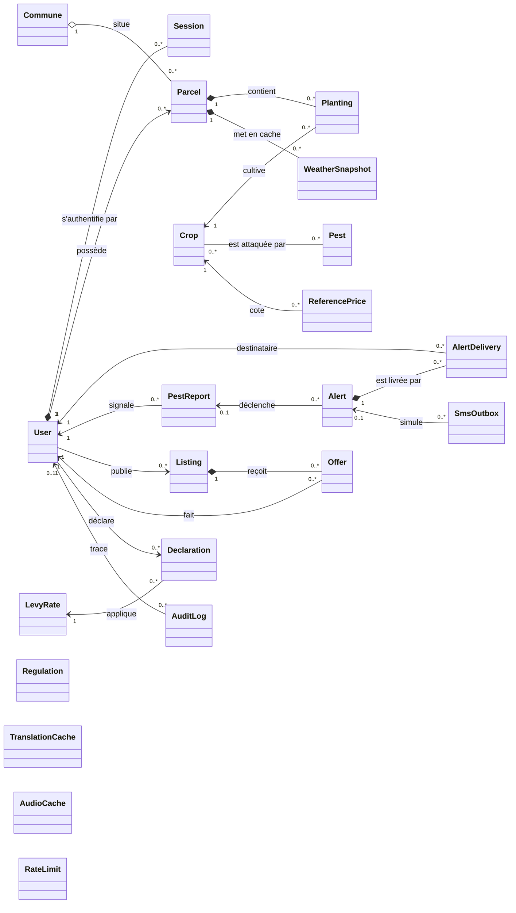
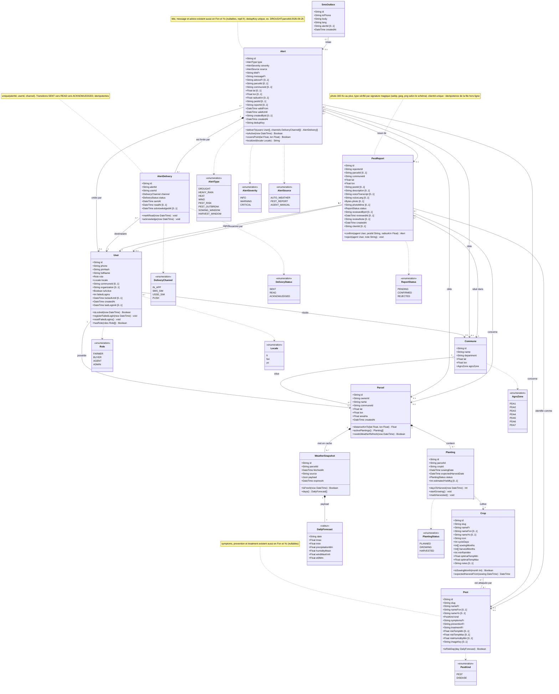
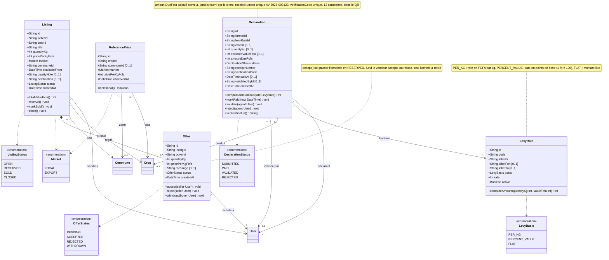
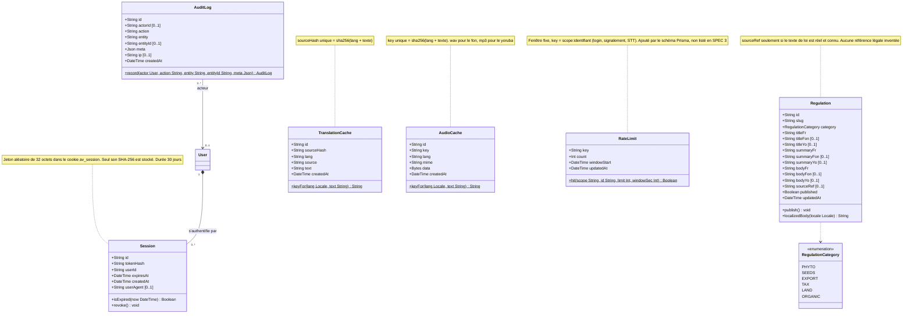

# 02 — Diagramme de classes du domaine

> Source de vérité : [SPEC §3](../SPEC.md#3-modèle-de-données-source-de-vérité--prismaschemaprisma), puis `prisma/schema.prisma`.
> Les **attributs** reflètent exactement le modèle persistant. Les **méthodes** sont les règles métier du domaine :
> elles sont implémentées dans des services serveur (`src/lib/...`) et non dans Prisma, qui ne produit que des types de données.
> Le diagramme décrit donc le modèle conceptuel. Chaque méthode indique le service qui en porte la responsabilité (voir le tableau en fin de page).

## Conventions

- Types : `String`, `Int` (montants en **FCFA entiers**, quantités en **kg**), `Float` (coordonnées, surfaces en ha),
  `DateTime`, `Boolean`, `Json`, `Bytes`. `Int[]` est un tableau PostgreSQL.
- Un attribut suffixé `[0..1]` est facultatif (nullable).
- Identifiants : `String` cuid. Textes multilingues : triplets `xxxFr`, `xxxFon [0..1]`, `xxxYo [0..1]`.
- `*--` composition (la partie n'existe pas sans le tout, suppression en cascade), `o--` agrégation (le tout regroupe
  des parties qui lui survivent), `-->` association navigable, `--` association simple.
- Noms d'énumérations, types et nullabilités alignés sur `prisma/schema.prisma` (lu le 25/09/2026). Les écarts avec la SPEC sont listés en fin de page.

Le modèle est découpé en trois vues détaillées précédées d'une vue d'ensemble. Dans chaque vue, les classes
détaillées ailleurs sont présentées réduites à leur nom.

## Vue d'ensemble (simplifiée)

`Regulation`, `TranslationCache`, `AudioCache` et `RateLimit` n'ont pas d'association : ce sont des contenus ou des caches autonomes.

## Vue 1 — Noyau et monitoring

`DailyForecast` est un objet valeur (stéréotype `«valeur»`) : il n'a pas de table, il est sérialisé dans `WeatherSnapshot.payload`.
C'est l'entrée du moteur de règles pur `src/lib/monitoring/rules.ts`.

## Vue 2 — Marché et recettes

## Vue 3 — Contenu et sécurité

`TranslationCache.lang` et `AudioCache.lang` sont des chaînes dans le schéma Prisma (et non l'énumération `Locale`) :
l'API 229langues nomme le yoruba `yoruba` pour la synthèse vocale et `yo` pour la traduction.
`RateLimit` n'a pas de lien vers `User` : sa clé porte l'identifiant (téléphone, identifiant utilisateur ou IP).

## Méthodes métier → responsable

| Méthode | Règle | Service responsable (unique) |
|---|---|---|
| `User.isLocked`, `registerFailedLogin` | 5 échecs → blocage 15 min | `src/lib/auth/` |
| `Session.isExpired`, `revoke` | 30 jours, jeton haché SHA-256 | `src/lib/auth/` |
| `Parcel.distanceKmTo`, `Alert.coversPoint` | formule de haversine | `src/lib/monitoring/` (pur) |
| `WeatherSnapshot.isFresh`, `Parcel.needsWeatherRefresh` | cache 3 h | service météo (orchestrateur monitoring) |
| `Pest.isRiskDay`, `Crop.isSowingMonth` | seuils SPEC §4 | `src/lib/monitoring/rules.ts` (pur) |
| `Alert.deliverTo` | IN_APP + SMS_SIM pour les FARMER concernés, `upsert` sur unique(alertId, userId, channel) | service d'alertes |
| `AlertDelivery.markRead`, `acknowledge` | transitions monotones, idempotentes | service d'alertes (Server Action + `/api/offline/sync`) |
| `PestReport.confirm`, `reject` | rôle AGENT/ADMIN, crée `PEST_OUTBREAK` (15 km par défaut), audit | service de signalements |
| `Offer.accept`, `reject`, `withdraw` | propriété vendeur / acheteur vérifiée | service marché |
| `LevyRate.computeAmount`, `Declaration.computeAmountDue` | calcul serveur, arrondi à l'entier FCFA | service recettes |
| `Declaration.markPaid`, `validate` | guichet AGENT ou « Payer (démo) » | service recettes |
| `RateLimit.hit` | quotas login, signalement, STT | `src/lib/security/` |
| `AuditLog.record` | toute action AGENT / ADMIN | `src/lib/security/` |
| `TranslationCache.keyFor`, `AudioCache.keyFor` | sha256(lang + texte) | `src/lib/langues/` |

## Écarts entre la SPEC §3 et le schéma Prisma

Relevés lors de l'alignement. Ils sont signalés à l'orchestrateur ; ce diagramme suit le schéma Prisma.

| N° | Élément | SPEC §3 | `schema.prisma` | Effet |
|---|---|---|---|---|
| 1 | `RateLimit` | absent | modèle ajouté (`key`, `count`, `windowStart`) | conforme à SPEC §8 « rate-limit en base » ; ajouté en vue 3 |
| 2 | `PestReport.photo`, `photoMime` | obligatoires | nullables (`Bytes?`, `String?`) | un signalement sans photo (voix seule) devient possible ; l'obligation, si voulue, doit être portée par zod |
| 3 | Formats de photo | webp / jpeg | commentaire : jpeg / webp / png | à trancher : la séquence 04 suit la SPEC (webp, jpeg) |
| 4 | `Alert.adviceFr` | non précisé | nullable | conseil facultatif |
| 5 | `Alert.reportId` | non précisé | non unique (`PestReport.alerts Alert[]`) | multiplicité `0..*` ; l'unicité d'une alerte de foyer par signalement repose sur `dedupKey = PEST_OUTBREAK:<reportId>` |
| 6 | `AgroZone` | « 8 pôles, ex. PDA1…PDA7 » | 7 valeurs `PDA1` à `PDA7` | la SPEC se contredit ; le schéma retient 7 pôles |
| 7 | `TranslationCache.lang`, `AudioCache.lang` | non typé | `String` | pas l'énumération `Locale` |
| 8 | `Crop.optimalTempMin/Max` | non typé | `Float` | — |
| 9 | `Commune.name` | non précisé | unique | — |
