# 03 — Séquence : alerte climatique automatique

> Source : [SPEC §4 (monitoring de bout en bout)](../SPEC.md#4-monitoring-de-bout-en-bout-cœur-évalué), §5 (langues), §6 (hors ligne).
> Cas d'utilisation : « Générer les alertes automatiques » (acteur : Planificateur), puis « Consulter ses alertes »,
> « Écouter un contenu » et « Accuser réception » (acteur : Exploitant·e).

## Description du scénario

Chaque jour, le planificateur Vercel Cron appelle `GET /api/cron/monitoring`. La route vérifie le secret partagé, puis
délègue au service de monitoring. Pour chaque parcelle portant une culture `PLANNED` ou `GROWING`, le service réutilise le
`WeatherSnapshot` s'il a moins de 3 h, sinon il interroge Open-Meteo (7 jours, fuseau Africa/Porto-Novo) et enregistre un
nouveau snapshot. Le moteur de règles pur (`src/lib/monitoring/rules.ts`, sans accès à la base) reçoit les prévisions, les
cultures et les ravageurs liés, et renvoie des alertes candidates, chacune avec sa `dedupKey`
(ex. `DROUGHT:<parcelId>:<yyyy-mm-dd>`). Une candidate déjà connue est ignorée. Pour une nouvelle candidate, le texte
français est traduit en fon et en yoruba par l'API 229langues (via `TranslationCache`), avec repli sur le français en cas
d'échec. L'alerte est créée, puis livrée à la propriétaire sur deux canaux : `IN_APP` et `SMS_SIM` (écriture dans
`SmsOutbox`, visible dans le simulateur `/agent/sms`, étiqueté DÉMO).

L'exploitante ouvre ensuite l'application : la livraison passe en `READ`. Elle écoute l'alerte en fon (audio servi par
le proxy `/api/voice/tts`, mis en cache dans `AudioCache`), puis touche « J'ai compris » : la livraison passe en
`ACKNOWLEDGED`, ce qui alimente le taux d'accusés du tableau de bord AGENT. Hors ligne, l'accusé est mis en file dans
IndexedDB et rejoué au retour du réseau, de façon idempotente.

## Diagramme

```mermaid
sequenceDiagram
    autonumber
    participant CRON as Planificateur<br/>Vercel Cron
    participant RT as Route<br/>/api/cron/monitoring
    participant MON as Service de<br/>monitoring
    participant DB as Base de données<br/>PostgreSQL (Prisma)
    participant OM as Open-Meteo
    participant RUL as Moteur de règles<br/>(pur)
    participant LG as API 229langues
    participant SMS as Simulateur SMS<br/>(SmsOutbox)
    actor EXP as Exploitant·e<br/>(navigateur / PWA)

    CRON->>RT: GET /api/cron/monitoring<br/>Authorization: Bearer CRON_SECRET
    alt secret absent ou invalide
        RT-->>CRON: 401 Unauthorized (corps générique)
    else secret valide (comparaison à temps constant)
        RT->>MON: runMonitoring(trigger = CRON, now)
        MON->>DB: parcelles avec cultures PLANNED ou GROWING<br/>+ cultures + ravageurs liés
        DB-->>MON: parcelles[]

        loop pour chaque parcelle
            MON->>DB: dernier WeatherSnapshot(parcelId)
            DB-->>MON: snapshot ou null
            alt snapshot frais (expiresAt > now)
                Note over MON: réutilise snapshot.payload<br/>aucun appel réseau
            else snapshot expiré ou absent
                MON->>OM: GET /v1/forecast?latitude, longitude<br/>daily = tmax, tmin, pluie, humidité, vent, ET0<br/>timezone = Africa/Porto-Novo, 7 jours
                alt Open-Meteo répond (délai max 8 s)
                    OM-->>MON: 200 daily[7]
                    MON->>MON: valider la réponse (zod)
                    MON->>DB: INSERT WeatherSnapshot<br/>(fetchedAt = now, expiresAt = now + 3 h)
                else échec ou délai dépassé
                    OM-->>MON: erreur / timeout
                    Note over MON: repli sur le snapshot expiré s'il existe,<br/>sinon parcelle ignorée et erreur journalisée
                end
            end

            MON->>RUL: evaluate(prévisions, plantings, pests, now)
            RUL-->>MON: alertes candidates[] (type, sévérité, textes fr, dedupKey)

            loop pour chaque candidate
                MON->>DB: Alert existe-t-elle pour cette dedupKey ?
                alt déjà présente
                    DB-->>MON: oui
                    Note over MON: doublon ignoré
                else nouvelle
                    DB-->>MON: non
                    MON->>DB: TranslationCache(sha256(lang + texte)) pour fon et yo
                    alt traduction en cache
                        DB-->>MON: textes fon / yo
                    else absente du cache
                        MON->>LG: POST /api/v1/translate<br/>{text, from_lang: fr, to_lang: fon puis yo}
                        alt l'API répond
                            LG-->>MON: data.text
                            MON->>DB: INSERT TranslationCache
                        else erreur ou délai dépassé
                            LG-->>MON: erreur / timeout
                            Note over MON: champs Fon / Yo laissés à null<br/>repli fr à l'affichage
                        end
                    end
                    MON->>DB: INSERT Alert (source AUTO_WEATHER, dedupKey unique)
                    Note over MON,DB: conflit d'unicité sur dedupKey<br/>(exécution concurrente) = doublon ignoré
                    MON->>DB: INSERT AlertDelivery IN_APP (SENT)<br/>+ AlertDelivery SMS_SIM (SENT)<br/>unique(alertId, userId, channel)
                    MON->>SMS: écrire SMS court dans la langue<br/>de la propriétaire (repli fr)
                    SMS->>DB: INSERT SmsOutbox (toPhone, body, lang, alertId)
                end
            end
        end

        MON-->>RT: bilan {parcelles, snapshots, alertes créées, doublons, erreurs}
        RT-->>CRON: 200 JSON bilan (sans donnée personnelle)
    end

    Note over EXP: plus tard : l'exploitante ouvre l'application

    EXP->>RT: GET /app/alertes (cookie av_session)
    Note right of RT: rendu serveur (RSC)<br/>session + rôle FARMER vérifiés
    RT->>DB: AlertDelivery IN_APP de l'utilisatrice + Alert
    DB-->>RT: livraisons[]
    RT->>DB: UPDATE status = READ, readAt = now<br/>(uniquement si SENT)
    RT-->>EXP: liste des alertes dans sa langue<br/>(pictogramme, sévérité, conseil)

    EXP->>RT: toucher « Écouter » en fon<br/>POST /api/voice/tts {texte, lang: fon}
    RT->>DB: AudioCache(sha256(fon + texte))
    alt audio en cache
        DB-->>RT: audio wav
        RT-->>EXP: audio/wav (lecture dans le navigateur)
    else absent
        RT->>LG: POST /api/v1/tts {text, language: fon}
        alt l'API répond (délai borné)
            LG-->>RT: audio wav
            RT->>DB: INSERT AudioCache
            RT-->>EXP: audio/wav (lecture dans le navigateur)
        else erreur ou délai dépassé
            LG-->>RT: erreur
            RT-->>EXP: 503 générique
            Note over EXP: message « audio indisponible »<br/>lecture du texte, synthèse fr du navigateur proposée
        end
    end

    EXP->>EXP: toucher « J'ai compris »
    alt en ligne
        EXP->>RT: Server Action acknowledgeAlert(deliveryId)
        RT->>RT: zod + session + propriété<br/>(delivery.userId = utilisatrice)
        RT->>DB: UPDATE status = ACKNOWLEDGED,<br/>acknowledgedAt = now (si pas déjà fait)
        RT-->>EXP: confirmation visuelle et sonore
    else hors ligne
        EXP->>EXP: IndexedDB : file.push({clientId, type: ACK, deliveryId})
        Note over EXP: bandeau « Hors ligne »<br/>alerte affichée « comprise, envoi en attente »
        Note over EXP: retour du réseau (événement online)
        EXP->>RT: POST /api/offline/sync [{clientId, type: ACK, deliveryId}]
        RT->>RT: zod + session + propriété de chaque élément
        RT->>DB: UPDATE ACKNOWLEDGED si pas déjà fait<br/>(rejouer ne change rien)
        RT-->>EXP: 200 {clientId: ok}
        EXP->>EXP: retirer l'élément de la file
    end
```

Dans ce diagramme, le participant « Route » représente la couche Next.js exposée : route handler du cron, rendu RSC de
`/app/alertes`, proxy `/api/voice/tts`, Server Action et `/api/offline/sync`. Ce regroupement garde le diagramme lisible.

## Préconditions

- `CRON_SECRET` est défini dans les variables d'environnement Vercel. Vercel Cron l'envoie automatiquement dans l'en-tête `Authorization`.
- Au moins une parcelle porte une culture `PLANNED` ou `GROWING`. Les cultures et ravageurs du CMS sont renseignés.
- La propriétaire est un compte `FARMER` actif avec un numéro normalisé `+229…` et une langue (`locale`).
- Pour le parcours hors ligne, le service worker est installé et la page `/app/alertes` a été visitée au moins une fois (pré-cache).

## Postconditions

- Chaque parcelle traitée a un `WeatherSnapshot` de moins de 3 h, ou l'échec est journalisé.
- Chaque risque détecté existe **une seule fois** en `Alert` (unicité de `dedupKey`), avec textes fon / yo ou repli fr.
- Chaque nouvelle alerte a deux `AlertDelivery` (`IN_APP`, `SMS_SIM`) pour la propriétaire, et une ligne `SmsOutbox`.
- Après le parcours de l'exploitante, la livraison `IN_APP` est `ACKNOWLEDGED` avec `readAt` et `acknowledgedAt` renseignés.
  Le taux d'accusés du tableau de bord AGENT en tient compte.

## Scénarios d'exception

| N° | Situation | Comportement attendu |
|---|---|---|
| E1 | Secret du cron absent ou faux | 401 avec un corps générique. Aucun traitement. Pas de détail sur la raison. |
| E2 | Open-Meteo indisponible ou lent (délai de 8 s dépassé, `OPEN_METEO_TIMEOUT_MS`) | Réutilisation du snapshot expiré s'il existe (les alertes restent pertinentes à quelques heures près). Sinon, parcelle ignorée, compteur `erreurs` incrémenté, le lot continue. |
| E3 | Réponse Open-Meteo malformée | Rejet par zod, traité comme E2. Aucune donnée non validée n'entre en base. |
| E4 | API 229langues en erreur ou en démarrage lent (jusqu'à 60 s) | Délai court dans le cron. Champs fon / yo à `null`, affichage en français. L'alerte n'est **jamais** bloquée par la traduction. |
| E5 | Deux exécutions concurrentes (cron et bouton AGENT « Lancer l'analyse ») | La contrainte unique sur `dedupKey` et `unique(alertId, userId, channel)` absorbe la course : le conflit est traité comme un doublon. |
| E6 | Durée maximale d'exécution de la fonction Vercel approchée | Le service s'arrête proprement au budget de temps, renvoie un bilan partiel. Les parcelles non traitées le seront au déclenchement suivant, ou à l'ouverture de la parcelle par sa propriétaire (déclencheur 2). |
| E7 | TTS fon indisponible | 503 générique. L'interface affiche le texte et propose la synthèse française du navigateur. |
| E8 | Accusé rejoué deux fois (file hors ligne, double clic) | Idempotent : l'état reste `ACKNOWLEDGED`, `acknowledgedAt` garde la première valeur. |
| E9 | Accusé sur une livraison d'une autre utilisatrice (IDOR) | Refus générique, tentative journalisée côté serveur. Aucune modification. |
| E10 | Session expirée au moment de la synchronisation | 401. La file est conservée dans IndexedDB et rejouée après reconnexion. |
