# 04 — Séquence : signalement d'un ravageur, validation, alerte de zone

> Source : [SPEC §3 (PestReport, Alert)](../SPEC.md#3-modèle-de-données-source-de-vérité--prismaschemaprisma),
> §4 (règle PEST_OUTBREAK), §5 (voix), §6 (file hors ligne), §8 (sécurité des envois).
> Cas d'utilisation : « Signaler un ravageur » (Exploitant·e), « Valider / rejeter un signalement » (Agent de l'État),
> « Livrer une alerte » (système).

## Description du scénario

Dans son champ, l'exploitante ouvre `/app/signaler`. Elle photographie la plante atteinte (facultatif si elle dicte) : le navigateur redimensionne
l'image (1280 px au plus) et la réencode en webp qualité 0,7 avant tout envoi. Elle peut aussi décrire le problème à voix
haute en fon : l'audio part vers le proxy serveur `/api/voice/stt`, qui appelle l'API 229langues sans jamais exposer de
secret au navigateur, et la transcription est affichée. La position est prise par la géolocalisation du navigateur, ou à
défaut par la parcelle choisie. À l'envoi, le serveur vérifie la session, le rôle `FARMER`, le quota (rate-limit), la taille,
la signature magique de l'image et le schéma zod. Le signalement est enregistré en `PENDING`. Sans réseau, il est placé
dans une file IndexedDB et synchronisé plus tard par `/api/offline/sync`. Le `clientId` rend le rejeu idempotent.

L'agent de l'État voit le signalement dans `/agent/signalements`, examine la photo (servie par la route autorisée
`/api/reports/[id]/photo`), identifie le ravageur et confirme. Le serveur crée alors une alerte `PEST_OUTBREAK`
(rayon de 15 km par défaut) avec les conseils de prévention et de traitement du ravageur issus du CMS. Il sélectionne toutes
les parcelles situées dans le rayon (formule de haversine) et livre l'alerte à leurs propriétaires `FARMER` en `IN_APP`
et `SMS_SIM`. Chaque décision de l'agent est inscrite au journal d'audit.

## Diagramme

```mermaid
sequenceDiagram
    autonumber
    actor EXP as Exploitant·e<br/>(navigateur / PWA)
    participant SW as Service worker<br/>+ file IndexedDB
    participant APP as Next.js<br/>Server Actions / routes
    participant SEC as Contrôles<br/>(auth, rate-limit, zod)
    participant REP as Service de<br/>signalements
    participant LG as API 229langues
    participant DB as Base de données<br/>PostgreSQL (Prisma)
    participant AL as Service<br/>d'alertes
    actor AGT as Agent de l'État
    actor VOI as Exploitant·es<br/>voisin·es

    EXP->>EXP: ouvrir /app/signaler, choisir la culture (pictogramme)
    Note over EXP: au moins une preuve : photo, dictée, ou les deux<br/>(photo nullable dans le schéma, obligation portée par zod)
    opt photo
        EXP->>EXP: prendre une photo
        Note over EXP: compression côté client (canvas)<br/>1280 px au plus, webp qualité 0,7<br/>environ 100 à 300 Ko
    end

    opt dictée en fon ou en yoruba
        EXP->>APP: POST /api/voice/stt (multipart audio, langue fon)
        APP->>SEC: session FARMER + rate-limit STT + taille audio
        alt contrôle refusé
            SEC-->>APP: refus
            APP-->>EXP: 429 ou 401 générique
        else accepté
            APP->>LG: POST /api/v1/stt (audio, fon)<br/>secrets côté serveur uniquement
            alt l'API répond
                LG-->>APP: transcription
                APP-->>EXP: texte affiché, modifiable
            else erreur ou délai dépassé
                LG-->>APP: erreur
                APP-->>EXP: « dictée indisponible », la photo suffit
            end
        end
    end

    EXP->>EXP: géolocalisation navigateur<br/>(à défaut : coordonnées de la parcelle choisie)
    EXP->>EXP: générer clientId (UUID)
    EXP->>EXP: toucher « Envoyer »

    alt en ligne
        EXP->>APP: Server Action submitPestReport<br/>(photo, lat, lon, parcelId?, texte?, transcript?, clientId)
    else hors ligne
        EXP->>SW: file.push(signalement complet, clientId)
        SW-->>EXP: « enregistré, envoi au retour du réseau »
        Note over SW: retour du réseau (événement online)
        SW->>APP: POST /api/offline/sync [signalement, clientId]
    end

    APP->>SEC: vérifier la requête
    SEC->>SEC: 1. taille du corps au plus 2 Mo, avant parsing
    SEC->>SEC: 2. session valide (cookie av_session) et rôle FARMER
    SEC->>DB: 3. rate-limit signalement (compteur en base)
    DB-->>SEC: quota restant
    SEC->>SEC: 4. signature magique : RIFF....WEBP ou FF D8 FF<br/>(png toléré par l'implémentation), photo au plus 300 Ko
    SEC->>SEC: 5. zod : lat / lon au Bénin, textes bornés,<br/>parcelId appartenant à l'utilisatrice
    alt un contrôle échoue
        SEC-->>APP: refus
        APP-->>EXP: erreur générique (détail en log serveur)<br/>depuis la file : élément conservé si 401 ou 429
    else tous les contrôles passent
        APP->>REP: createReport(input validé, reporterId)
        REP->>DB: PestReport existe pour ce clientId ?
        alt déjà reçu (rejeu de la file)
            DB-->>REP: signalement existant
            REP-->>APP: même identifiant, aucun doublon
        else nouveau
            REP->>DB: commune la plus proche de (lat, lon)
            REP->>DB: INSERT PestReport (status PENDING, photo Bytes, photoMime, clientId)
            REP->>DB: INSERT AuditLog (REPORT_CREATE)
            REP-->>APP: reportId
        end
        alt envoi direct
            APP-->>EXP: « signalement reçu, un agent va l'examiner »
        else envoi depuis la file
            APP-->>SW: 200 {clientId: ok, reportId}
            SW->>SW: retirer l'élément de la file
            SW-->>EXP: notification « signalement envoyé »
        end
    end

    Note over AGT,DB: notification de l'agent : compteur « en attente »<br/>dans /agent et /agent/signalements

    AGT->>APP: GET /agent/signalements
    APP->>SEC: session + rôle AGENT ou ADMIN
    APP->>DB: PestReport PENDING (sans la photo)
    DB-->>APP: liste
    APP-->>AGT: liste, carte des signalements
    AGT->>APP: GET /agent/signalements/[id]
    APP->>DB: signalement + ravageurs candidats pour la culture
    APP-->>AGT: détail, fiches ravageurs
    AGT->>APP: GET /api/reports/[id]/photo
    APP->>SEC: rôle AGENT / ADMIN (ou auteur du signalement)
    APP->>DB: photo, photoMime
    APP-->>AGT: image (Content-Type vérifié, nosniff, no-store)

    alt l'agent rejette
        AGT->>APP: Server Action reviewReport(id, REJECTED, note)
        APP->>SEC: zod + rôle AGENT / ADMIN
        APP->>REP: reject(agent, note)
        REP->>DB: UPDATE PestReport REJECTED, reviewedById, reviewedAt, reviewNote
        REP->>DB: INSERT AuditLog (REPORT_REJECT)
        APP-->>AGT: signalement clos
    else l'agent confirme et identifie le ravageur
        AGT->>APP: Server Action reviewReport(id, CONFIRMED, pestId, radiusKm = 15)
        APP->>SEC: zod + rôle AGENT / ADMIN
        APP->>REP: confirm(agent, pestId, radiusKm)
        REP->>DB: UPDATE PestReport CONFIRMED<br/>(seulement si encore PENDING)
        REP->>AL: createZoneAlert(report, pest, radiusKm)
        AL->>DB: Pest : nom, prévention, traitement (fr, fon, yo du CMS)
        AL->>DB: INSERT Alert PEST_OUTBREAK (source PEST_REPORT,<br/>lat, lon, radiusKm, pestId, reportId,<br/>dedupKey = PEST_OUTBREAK:reportId)
        AL->>DB: parcelles candidates dans la boîte englobante<br/>(lat ± r / 111, lon ± r / (111 cos lat))
        DB-->>AL: parcelles + propriétaires
        AL->>AL: filtrer par haversine(distance) au plus radiusKm,<br/>propriétaires FARMER actifs, dédupliqués
        loop pour chaque exploitant·e concerné·e
            AL->>DB: INSERT AlertDelivery IN_APP + SMS_SIM (SENT)<br/>unique(alertId, userId, channel)
            AL->>DB: INSERT SmsOutbox (texte dans sa langue, repli fr)
        end
        AL-->>REP: nombre de destinataires
        REP->>DB: INSERT AuditLog (REPORT_CONFIRM, meta : pestId, radiusKm, destinataires)
        APP-->>AGT: « alerte envoyée à N exploitant·es »
        VOI->>APP: ouverture de /app/alertes
        APP-->>VOI: alerte de zone : ravageur, distance, conseils, bouton Écouter
        Note over VOI: lecture puis « J'ai compris »,<br/>même parcours que la séquence 03
    end
```

## Préconditions

- L'exploitante est connectée avec le rôle `FARMER`. Pour le mode hors ligne, `/app/signaler` a été pré-cachée par le service worker.
- Le navigateur a l'autorisation caméra (ou fichier) et, si possible, géolocalisation et micro (`Permissions-Policy` autorise `self`).
- Le catalogue des ravageurs (`Pest`) et leurs liens aux cultures sont renseignés dans le CMS.
- L'agent est connecté avec le rôle `AGENT` ou `ADMIN`.

## Postconditions

- Un seul `PestReport` existe par `clientId`, quel que soit le nombre de rejeux.
- Après décision : le signalement est `CONFIRMED` ou `REJECTED`, avec `reviewedById`, `reviewedAt` et, si besoin, `reviewNote`.
- Si confirmé : une `Alert` `PEST_OUTBREAK` liée au signalement (`reportId`) et au ravageur (`pestId`) existe, et chaque
  propriétaire `FARMER` d'une parcelle dans le rayon a une livraison `IN_APP` et `SMS_SIM`.
- Chaque création et chaque décision figure dans `AuditLog` avec l'acteur, l'entité et l'identifiant.

## Scénarios d'exception

| N° | Situation | Comportement attendu |
|---|---|---|
| E1 | Corps de requête supérieur à 2 Mo | Rejet avant parsing, erreur générique. |
| E2 | Fichier dont la signature n'est ni webp ni jpeg (png toléré par `src/lib/security/image.ts`), ex. SVG ou exécutable renommé | Rejet, quelle que soit l'extension ou le `Content-Type` annoncé. Tentative journalisée. |
| E3 | Photo valide mais supérieure à 300 Ko après compression | Rejet avec un message invitant à reprendre la photo. Le client compresse à nouveau à qualité inférieure. |
| E4 | Quota de signalements ou de STT dépassé | 429 générique. Le signalement reste dans la file hors ligne s'il en venait. |
| E5 | Session expirée pendant la synchronisation | 401. La file est conservée et rejouée après reconnexion. |
| E6 | `parcelId` appartenant à une autre personne (IDOR) | Rejet par le contrôle de propriété. Aucune écriture. |
| E7 | Géolocalisation refusée ou indisponible | Coordonnées de la parcelle choisie. Sans parcelle, choix de la commune dans une liste. |
| E8 | API STT indisponible ou démarrage lent | Délai borné, message « dictée indisponible ». La photo et les pictogrammes suffisent au signalement. |
| E9 | Deux agents valident le même signalement en même temps | La mise à jour est conditionnelle (`status = PENDING`). Le second reçoit « déjà traité ». Une seule alerte (dedupKey `PEST_OUTBREAK:<reportId>`). |
| E10 | Aucune parcelle dans le rayon | L'alerte est créée (visible sur la carte AGENT), zéro livraison. L'agent peut élargir le rayon en émettant une alerte de zone manuelle. |
| E11 | Rôle `FARMER` ou `BUYER` qui appelle `reviewReport` ou la route photo | Refus côté serveur (`requireRole`), même si l'interface n'affiche pas le bouton. |
| E12 | Ni photo ni description ni transcription | Rejet zod : un signalement doit porter au moins une preuve. |
