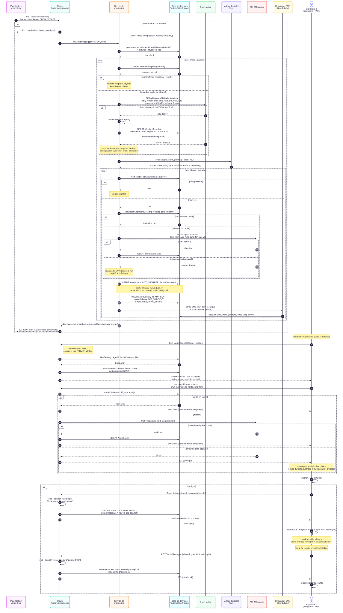
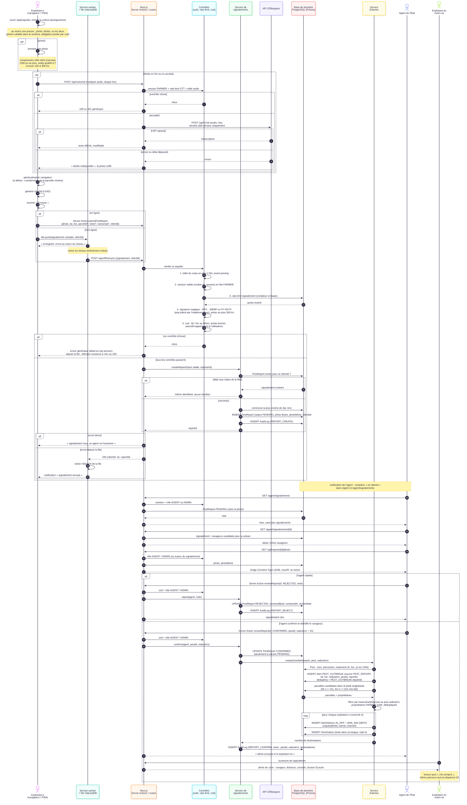

# Modélisation UML d'AgriVeille

Diagrammes en Mermaid, rendus directement par GitHub. Ils documentent l'architecture approuvée
([`docs/SPEC.md`](../SPEC.md), [`docs/ARCHITECTURE.md`](../ARCHITECTURE.md)). Le diagramme de classes suit
[`prisma/schema.prisma`](../../prisma/schema.prisma), qui fait foi.

| N° | Diagramme | Contenu |
|---|---|---|
| 01 | [Cas d'utilisation](01-cas-utilisation.md) | 4 acteurs principaux (plus le visiteur), 3 acteurs secondaires, 6 paquetages, `«include»` / `«extend»`, tableau acteur → cas |
| 02 | [Classes](02-classes.md) | vue d'ensemble, puis 3 vues : noyau et monitoring, marché et recettes, contenu et sécurité ; énumérations, multiplicités, compositions, méthodes métier, écarts SPEC / schéma |
| 03 | [Séquence : alerte climatique automatique](03-sequence-alerte-climatique.md) | cron authentifié, cache `WeatherSnapshot`, Open-Meteo, moteur de règles, `dedupKey`, traduction avec repli, livraisons, lecture, audio fon, accusé en ligne et hors ligne |
| 04 | [Séquence : signalement, validation, alerte de zone](04-sequence-signalement-ravageur.md) | photo compressée ou dictée fon, géolocalisation, file IndexedDB, contrôles serveur, validation AGENT, `PEST_OUTBREAK`, haversine, audit |

Chaque séquence comporte une description, ses préconditions, ses postconditions et un tableau d'exceptions.

Validation : les 9 blocs Mermaid (7 ici, 2 dans `ARCHITECTURE.md`) passent l'analyseur `mermaid.parse`.

## Images

Les images SVG et PNG sont dans [`img/`](img/). Pour les régénérer : `pnpm uml:render`
(ou, dans VS Code, la tâche « UML : générer les images »). Le script utilise
`@mermaid-js/mermaid-cli` via `pnpm dlx`, sans l'ajouter aux dépendances. Dans VS Code,
l'extension recommandée `bierner.markdown-mermaid` affiche aussi les diagrammes dans l'aperçu Markdown.

### 01 · Cas d'utilisation

### 02 · Classes

### 03 · Séquence : alerte climatique automatique

### 04 · Séquence : signalement, validation, alerte de zone

